# Tarea 2 — Elementos básicos de interfaz de usuario

Catálogo interactivo de componentes de interfaz de usuario implementado en **tres tecnologías**:

1. **Android nativo con Views y layouts XML**
2. **Android nativo con Jetpack Compose**
3. **Flutter con Dart**

El objetivo del proyecto es implementar el mismo catálogo funcional en las tres tecnologías para comparar sus componentes, estructura, forma de manejar estado e interacción, navegación, layouts y mecanismos de retroalimentación.

Cada versión contiene una pantalla principal y seis secciones:

- **Sección 1:** Entrada de texto
- **Sección 2:** Botones y acciones
- **Sección 3:** Elementos de selección
- **Sección 4:** Listas y colecciones
- **Sección 5:** Información y retroalimentación
- **Sección 6:** Contenedores y estructura

Además, las tres aplicaciones incluyen navegación entre secciones, compatibilidad con tema claro/oscuro, interfaz en español, demostraciones interactivas y una conexión funcional entre la Sección 1 y la Sección 4.

---

## Índice

- [Datos de identificación](#datos-de-identificación)
- [Descripción general](#descripción-general)
- [Tecnologías utilizadas](#tecnologías-utilizadas)
- [Estructura del repositorio](#estructura-del-repositorio)
- [Requisitos implementados](#requisitos-implementados)
- [Instrucciones de compilación y ejecución](#instrucciones-de-compilación-y-ejecución)
  - [Android Views / XML](#1-android-views--xml)
  - [Jetpack Compose](#2-jetpack-compose)
  - [Flutter](#3-flutter)
- [Tabla de equivalencias](#tabla-de-equivalencias)
- [Conexión entre secciones](#conexión-entre-secciones)
- [Capturas de pantalla](#capturas-de-pantalla)
- [Generación de APK](#generación-de-apk)
- [Reflexión final](#reflexión-final)
- [Referencias](#referencias)

---

# Datos de identificación

| Dato | Información |
|---|---|
| **Nombre completo** | **Zyanya Maxi Sánchez Valadez** |
| **Número de boleta** | **2024630593** |
| **Grupo** | **7CV4** |
| **Práctica / tarea** | Tarea 2 — Elementos básicos de interfaz de usuario |

> **Importante:** antes de entregar, sustituir los tres campos entre corchetes por los datos reales.

---

# Descripción general

Este repositorio contiene tres implementaciones de una misma aplicación tipo catálogo. El propósito es mostrar, probar y comparar los elementos básicos de una interfaz gráfica móvil utilizando tres enfoques de desarrollo diferentes.

La aplicación no funciona únicamente como una colección visual de controles. Cada componente incluye:

- nombre del elemento;
- descripción de su función;
- demostración interactiva;
- retroalimentación visible cuando corresponde;
- comportamiento real ante las acciones del usuario.

Las tres versiones mantienen la misma organización conceptual para facilitar la comparación entre tecnologías.

## Versiones incluidas

| Carpeta | Tecnología | Lenguaje principal | Enfoque |
|---|---|---|---|
| `android-views/` | Android Views + XML | Kotlin + XML | Interfaz basada en jerarquías de `View` y layouts XML |
| `android-compose/` | Jetpack Compose | Kotlin | Interfaz declarativa mediante funciones `@Composable` |
| `flutter/` | Flutter | Dart | Interfaz declarativa basada en widgets |

---

# Tecnologías utilizadas

## Android Views / XML

La versión tradicional de Android utiliza:

- Kotlin para lógica e interacción;
- layouts XML para declarar la interfaz;
- View Binding para acceder a los componentes;
- Android Navigation Component;
- Material Components;
- RecyclerView;
- SwipeRefreshLayout;
- ViewPager2;
- Coil 2.7.0 para carga de imágenes desde Internet.

Configuración principal del proyecto:

- `minSdk`: **24**
- `targetSdk`: **37**
- `compileSdk`: **37**
- compatibilidad Java: **11**

## Jetpack Compose

La segunda versión utiliza:

- Kotlin;
- Jetpack Compose;
- Material 3;
- Navigation Compose;
- estados mediante `remember` / estado Compose;
- Coil Compose 2.7.0 para imágenes remotas;
- layouts declarativos como `Row`, `Column`, `Box`, `LazyColumn` y `LazyVerticalGrid`.

Configuración principal:

- `minSdk`: **24**
- `targetSdk`: **37**
- `compileSdk`: **37**
- compatibilidad Java: **11**

## Flutter

La tercera versión utiliza:

- Flutter;
- Dart;
- Material 3;
- widgets con estado;
- `Drawer` como navegación principal;
- `ThemeMode.system`;
- localización en español mediante `flutter_localizations`;
- assets locales y `Image.network` para imágenes remotas.

Configuración del proyecto:

- Dart SDK: `^3.13.2`
- Material Icons habilitados;
- localización en español;
- asset local registrado en `pubspec.yaml`.

---

# Estructura del repositorio

```text
Tarea-2-Elementos-basicos-de-interfaz-de-usuario/
│
├── android-views/
│   └── Versión Android nativa con Views y XML
│
├── android-compose/
│   └── Versión Android nativa con Jetpack Compose
│
├── flutter/
│   └── Versión desarrollada con Flutter y Dart
│
├── docs/
│   ├── android-views/
│   │   ├── 00_menu.png
│   │   ├── 01_entrada_texto.png
│   │   ├── 02_botones_acciones.png
│   │   ├── 03_elementos_seleccion.png
│   │   ├── 04_listas_colecciones.png
│   │   ├── 05_informacion_retroalimentacion.png
│   │   └── 06_contenedores_estructura.png
│   │
│   ├── android-compose/
│   │   ├── 00_menu.png
│   │   ├── 01_entrada_texto.png
│   │   ├── 02_botones_acciones.png
│   │   ├── 03_elementos_seleccion.png
│   │   ├── 04_listas_colecciones.png
│   │   ├── 05_informacion_retroalimentacion.png
│   │   └── 06_contenedores_estructura.png
│   │
│   └── flutter/
│       ├── 00_menu.png
│       ├── 01_entrada_texto.png
│       ├── 02_botones_acciones.png
│       ├── 03_elementos_seleccion.png
│       ├── 04_listas_colecciones.png
│       ├── 05_informacion_retroalimentacion.png
│       └── 06_contenedores_estructura.png
│
└── README.md
```

La captura `00_menu.png` documenta la pantalla principal de cada implementación y las capturas `01` a `06` corresponden directamente a las seis secciones solicitadas.

---

# Requisitos implementados

## Sección 1 — Entrada de texto

Se implementaron:

- campo de texto simple con etiqueta;
- validación y mensaje de error;
- contraseña con opción para mostrar u ocultar;
- teclado numérico;
- teclado para correo electrónico;
- teclado para teléfono;
- campo multilínea;
- selección mediante opciones predefinidas;
- búsqueda y filtrado.

Además, el campo de nombre se utiliza para demostrar la **conexión entre la Sección 1 y la Sección 4**.

---

## Sección 2 — Botones y acciones

Se implementaron:

- botón relleno;
- botón con contorno;
- botón de texto;
- botón solo con ícono;
- botón con ícono y texto;
- FAB normal;
- FAB extendido;
- selector segmentado / toggle;
- botón deshabilitado;
- botón con estado de carga;
- indicador visual durante la carga;
- respuesta visible a las acciones del usuario.

---

## Sección 3 — Elementos de selección

Se implementaron:

- checkbox normal;
- checkbox con estado indeterminado;
- radio buttons mutuamente excluyentes;
- switch;
- slider de valor único;
- slider de rango;
- lista desplegable;
- selector de fecha;
- selector de hora;
- chips de filtro seleccionables.

---

## Sección 4 — Listas y colecciones

Se implementaron:

- lista vertical con al menos 15 elementos;
- lista demostrativa con 20 elementos;
- cuadrícula;
- encabezados de sección;
- distintos tipos de fila;
- selección de un elemento para mostrar detalle;
- gesto lateral para eliminar;
- actualización arrastrando hacia abajo;
- estado vacío con texto e ilustración;
- pestañas;
- contenido desplazable horizontalmente entre pestañas.

---

## Sección 5 — Información y retroalimentación

Se implementaron:

- diferentes estilos de texto;
- diferentes tamaños;
- negrita, cursiva y subrayado;
- imagen local;
- imagen cargada desde URL;
- distintos modos de escalado;
- progreso lineal determinado;
- progreso circular determinado;
- progreso lineal indeterminado;
- progreso circular indeterminado;
- mensaje breve tipo toast;
- snackbar con acción;
- diálogo de confirmación;
- bottom sheet;
- tarjeta;
- separador;
- badge numérico.

---

## Sección 6 — Contenedores y estructura

Se implementaron:

- distribución horizontal;
- distribución vertical;
- contenido superpuesto;
- desplazamiento vertical;
- barra superior con título;
- acciones en barra superior;
- navegación inferior;
- ejemplo de pesos proporcionales.

---

# Requisitos transversales

| Requisito | Android Views | Compose | Flutter |
|---|:---:|:---:|:---:|
| Pantalla principal | ✅ | ✅ | ✅ |
| Navegación entre las seis secciones | ✅ | ✅ | ✅ |
| Regreso a Inicio | ✅ | ✅ | ✅ |
| Nombre de cada componente | ✅ | ✅ | ✅ |
| Explicación de cada componente | ✅ | ✅ | ✅ |
| Demostración interactiva | ✅ | ✅ | ✅ |
| Interacción real | ✅ | ✅ | ✅ |
| Tema claro / oscuro | ✅ | ✅ | ✅ |
| Adaptación al modo del sistema | ✅ | ✅ | ✅ |
| Interfaz en español | ✅ | ✅ | ✅ |
| Conexión entre secciones | ✅ | ✅ | ✅ |
| Diseño con espaciado y jerarquía visual | ✅ | ✅ | ✅ |

---

# Instrucciones de compilación y ejecución

## Requisitos generales

Para las versiones Android nativas se recomienda:

- Android Studio;
- Android SDK instalado;
- JDK compatible con el proyecto;
- un emulador Android o un dispositivo físico con depuración USB.

Para Flutter se necesita además:

- Flutter SDK;
- Dart;
- plugin de Flutter para Android Studio;
- Android toolchain configurado.

---

## 1. Android Views / XML

### Abrir desde Android Studio

1. Abrir Android Studio.
2. Seleccionar **Open**.
3. Seleccionar la carpeta:

```text
android-views/
```

4. Esperar a que Gradle termine la sincronización.
5. Seleccionar un dispositivo o emulador.
6. Ejecutar la aplicación con **Run**.

### Compilar desde terminal en Windows

Desde la raíz del repositorio:

```powershell
cd android-views
.\gradlew.bat assembleDebug
```

APK generado:

```text
android-views/app/build/outputs/apk/debug/app-debug.apk
```

### Instalación por ADB

Con un dispositivo conectado:

```powershell
adb install -r app\build\outputs\apk\debug\app-debug.apk
```

---

## 2. Jetpack Compose

### Abrir desde Android Studio

1. Abrir Android Studio.
2. Seleccionar **Open**.
3. Abrir:

```text
android-compose/
```

4. Esperar la sincronización de Gradle.
5. Seleccionar el dispositivo.
6. Ejecutar con **Run**.

### Compilar desde terminal en Windows

```powershell
cd android-compose
.\gradlew.bat assembleDebug
```

APK generado:

```text
android-compose/app/build/outputs/apk/debug/app-debug.apk
```

### Instalación por ADB

```powershell
adb install -r app\build\outputs\apk\debug\app-debug.apk
```

---

## 3. Flutter

### Verificar el entorno

Desde la carpeta `flutter/`:

```powershell
flutter doctor
```

Comprobar los dispositivos:

```powershell
flutter devices
```

Instalar dependencias:

```powershell
flutter pub get
```

Analizar el proyecto:

```powershell
flutter analyze
```

Ejecutar:

```powershell
flutter run
```

### Generar APK

```powershell
flutter build apk --debug
```

APK generado:

```text
flutter/build/app/outputs/flutter-apk/app-debug.apk
```

---

# Tabla de equivalencias

La siguiente tabla relaciona los componentes utilizados para resolver el mismo requisito en las tres tecnologías.

## Sección 1 — Entrada de texto

| Elemento | Android Views / XML | Jetpack Compose | Flutter |
|---|---|---|---|
| Campo de texto simple | `TextInputLayout` + `TextInputEditText` | `OutlinedTextField` | `TextField` |
| Etiqueta / hint | `TextInputLayout` / `hint` | `label` de `OutlinedTextField` | `InputDecoration.labelText` |
| Validación con error | `TextInputLayout.error` | `OutlinedTextField` + texto de error / estado | `InputDecoration.errorText` |
| Contraseña | `TextInputEditText` | `OutlinedTextField` | `TextField` |
| Mostrar / ocultar contraseña | `TextInputLayout` con `password_toggle` | `IconButton` + `PasswordVisualTransformation` | `obscureText` + `IconButton` |
| Entrada numérica | `inputType="number"` | `KeyboardOptions` numérico | `TextInputType.number` |
| Entrada de correo | `inputType="textEmailAddress"` | `KeyboardOptions` para email | `TextInputType.emailAddress` |
| Entrada telefónica | `inputType="phone"` | `KeyboardOptions` para teléfono | `TextInputType.phone` |
| Campo multilínea | `TextInputEditText` multilínea | `OutlinedTextField` multilínea | `TextField` con `minLines` / `maxLines` |
| Opciones / sugerencias | `Spinner` | `DropdownMenu` + `DropdownMenuItem` | `DropdownButtonFormField` |
| Barra de búsqueda | `SearchView` | `OutlinedTextField` con filtrado | `TextField` + ícono de búsqueda y filtrado |

---

## Sección 2 — Botones y acciones

| Elemento | Android Views / XML | Jetpack Compose | Flutter |
|---|---|---|---|
| Botón relleno | `MaterialButton` | `Button` | `FilledButton` |
| Botón con contorno | `MaterialButton` con estilo outlined | `OutlinedButton` | `OutlinedButton` |
| Botón de texto | `MaterialButton` estilo text | `TextButton` | `TextButton` |
| Botón solo con ícono | `ImageButton` | `IconButton` | `IconButton.filled` |
| Botón con ícono y texto | `MaterialButton` con icono | `Button` + `Icon` + `Text` | `FilledButton.icon` |
| FAB normal | `FloatingActionButton` | `FloatingActionButton` | `FloatingActionButton` |
| FAB extendido | `ExtendedFloatingActionButton` | `ExtendedFloatingActionButton` | `FloatingActionButton.extended` |
| Selector segmentado / toggle | `MaterialButtonToggleGroup` | `SingleChoiceSegmentedButtonRow` + `SegmentedButton` | `SegmentedButton` |
| Botón deshabilitado | `MaterialButton` con `enabled=false` | `Button(enabled=false)` | botón con `onPressed: null` |
| Botón con carga | `MaterialButton` + `ProgressBar` | `Button` + `CircularProgressIndicator` | `FilledButton` + `CircularProgressIndicator` |
| Respuesta visible | `TextView` actualizado desde Kotlin | estado Compose + `Text` | `setState()` + `Text` |

---

## Sección 3 — Elementos de selección

| Elemento | Android Views / XML | Jetpack Compose | Flutter |
|---|---|---|---|
| Checkbox | `MaterialCheckBox` | `Checkbox` | `Checkbox` |
| Estado indeterminado | `MaterialCheckBox.STATE_INDETERMINATE` | `TriStateCheckbox` | `Checkbox(tristate: true)` |
| Radio buttons | `RadioGroup` + `MaterialRadioButton` | `RadioButton` | `RadioGroup` + `RadioListTile` |
| Switch | `MaterialSwitch` | `Switch` | `SwitchListTile` |
| Slider | Material `Slider` | `Slider` | `Slider` |
| Slider de rango | Material `RangeSlider` | `RangeSlider` | `RangeSlider` |
| Lista desplegable | `Spinner` | `DropdownMenu` | `DropdownButtonFormField` |
| Selector de fecha | `MaterialDatePicker` | `DatePickerDialog` | `showDatePicker()` |
| Selector de hora | `MaterialTimePicker` | `TimePickerDialog` | `showTimePicker()` |
| Chips de filtro | `ChipGroup` + `Chip` | `FilterChip` | `FilterChip` |

---

## Sección 4 — Listas y colecciones

| Elemento | Android Views / XML | Jetpack Compose | Flutter |
|---|---|---|---|
| Lista vertical | `RecyclerView` + `LinearLayoutManager` | `LazyColumn` | `ListView.builder` |
| Cuadrícula | `RecyclerView` + `GridLayoutManager` | `LazyVerticalGrid` | `GridView.builder` |
| Encabezados de sección | `RecyclerView` con distintos tipos de fila | `LazyColumn` con items de distinto tipo | `ListView.builder` con encabezados condicionales |
| Dos tipos de elemento | múltiples ViewHolder / layouts | distintos bloques dentro de `LazyColumn` | modelo `_ElementoSeccion` + filas condicionales |
| Abrir detalle | `MaterialAlertDialogBuilder` | `AlertDialog` | `showDialog()` + `AlertDialog` |
| Deslizar para eliminar | `ItemTouchHelper` | `SwipeToDismissBox` | `Dismissible` |
| Pull-to-refresh | `SwipeRefreshLayout` | `PullToRefreshBox` | `RefreshIndicator` |
| Estado vacío | `FrameLayout` + `ImageView` + `TextView` | `Column` / `Icon` / `Text` | `Column` / `Icon` / `Text` |
| Pestañas | `TabLayout` | `TabRow` | `TabBar` |
| Contenido deslizable entre pestañas | `ViewPager2` | `HorizontalPager` | `TabBarView` |

---

## Sección 5 — Información y retroalimentación

| Elemento | Android Views / XML | Jetpack Compose | Flutter |
|---|---|---|---|
| Texto | `TextView` | `Text` | `Text` |
| Tamaños / estilos | atributos XML + propiedades de `TextView` | `TextStyle` / `MaterialTheme.typography` | `TextStyle` |
| Imagen local | `ImageView` | `Image` | `Image.asset` |
| Imagen desde URL | `ImageView` + Coil | Coil `AsyncImage` | `Image.network` |
| Modos de escalado | `ImageView.ScaleType` | `ContentScale` | `BoxFit` |
| Progreso lineal determinado | `LinearProgressIndicator` | `LinearProgressIndicator(progress=...)` | `LinearProgressIndicator(value: ...)` |
| Progreso circular determinado | `CircularProgressIndicator` | `CircularProgressIndicator(progress=...)` | `CircularProgressIndicator(value: ...)` |
| Progreso indeterminado | indicadores sin progreso fijo | indicadores sin valor de progreso | indicadores con `value: null` |
| Toast / mensaje breve | `Toast` | `Toast` de Android | `OverlayEntry` como mensaje breve equivalente |
| Snackbar | Material `Snackbar` | `SnackbarHost` / `SnackbarHostState` | `ScaffoldMessenger` + `SnackBar` |
| Acción en snackbar | `setAction()` | `actionLabel` | `SnackBarAction` |
| Diálogo | `MaterialAlertDialogBuilder` | `AlertDialog` | `showDialog()` + `AlertDialog` |
| Bottom sheet | `BottomSheetDialog` | `ModalBottomSheet` | `showModalBottomSheet()` |
| Tarjeta | `MaterialCardView` | `Card` | `Card` |
| Separador | `View` | `HorizontalDivider` | `Divider` |
| Badge numérico | `TextView` configurado como badge | `Badge` + `BadgedBox` | `Badge` |

> Flutter no incluye un widget Material llamado `Toast` equivalente al `Toast` nativo de Android. En esta implementación el mensaje breve se resolvió con `OverlayEntry`, conservando el comportamiento esperado: aparece temporalmente y desaparece automáticamente.

---

## Sección 6 — Contenedores y estructura

| Elemento | Android Views / XML | Jetpack Compose | Flutter |
|---|---|---|---|
| Distribución horizontal | `LinearLayout` horizontal | `Row` | `Row` |
| Distribución vertical | `LinearLayout` vertical | `Column` | `Column` |
| Superposición | `FrameLayout` | `Box` | `Stack` |
| Scroll vertical | `ScrollView` / `NestedScrollView` | `verticalScroll` / contenedor desplazable | `SingleChildScrollView` / `ListView` |
| Barra superior | `MaterialToolbar` | `TopAppBar` | `AppBar` |
| Acciones de barra | elementos de menú / toolbar | `IconButton` | `IconButton` |
| Navegación inferior | `BottomNavigationView` | `NavigationBar` + `NavigationBarItem` | `NavigationBar` + `NavigationDestination` |
| Pesos proporcionales | `LinearLayout` + `layout_weight` | `Row` + `Modifier.weight` | `Expanded(flex: ...)` |

---

## Equivalencias transversales

| Función | Android Views / XML | Jetpack Compose | Flutter |
|---|---|---|---|
| Navegación principal | Navigation Component + menú | Navigation Compose | `Drawer` + estado de pantalla |
| Contenedor general | XML + Fragment | `Scaffold` / composables | `Scaffold` |
| Tema claro / oscuro | tema `DayNight` | tema Compose dependiente del sistema | `ThemeMode.system` |
| Estado de UI | propiedades de Views + Kotlin | estado Compose (`remember`) | `StatefulWidget` + `setState()` |
| Conexión S1 → S4 | objeto compartido `DatosCompartidos` | estado/datos compartidos | `DatosCompartidos` + `ValueNotifier` |
| Imagen remota | Coil 2.7.0 | Coil Compose 2.7.0 | `Image.network` |

---

# Conexión entre secciones

En las tres implementaciones se agregó una funcionalidad transversal que vincula la **Sección 1: Entrada de texto** con la **Sección 4: Listas y colecciones**.

El flujo es:

```text
Sección 1
   │
   │ Capturar un nombre
   ▼
Agregar a Listas y colecciones
   │
   ▼
Dato compartido en memoria
   │
   ▼
Sección 4
   │
   ▼
El nombre aparece dentro de la lista vertical
```

Esto demuestra que las secciones no funcionan únicamente como pantallas aisladas, sino que pueden intercambiar datos y modificar la interfaz a partir de una interacción realizada previamente.

---

# Capturas de pantalla

Las capturas se almacenan en `docs/` y mantienen la misma nomenclatura en las tres tecnologías.

## Android Views / XML

<table>
<tr>
<td align="center"><b>Menú principal</b><br>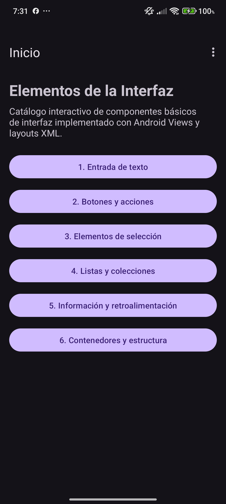</td>
<td align="center"><b>1. Entrada de texto</b><br>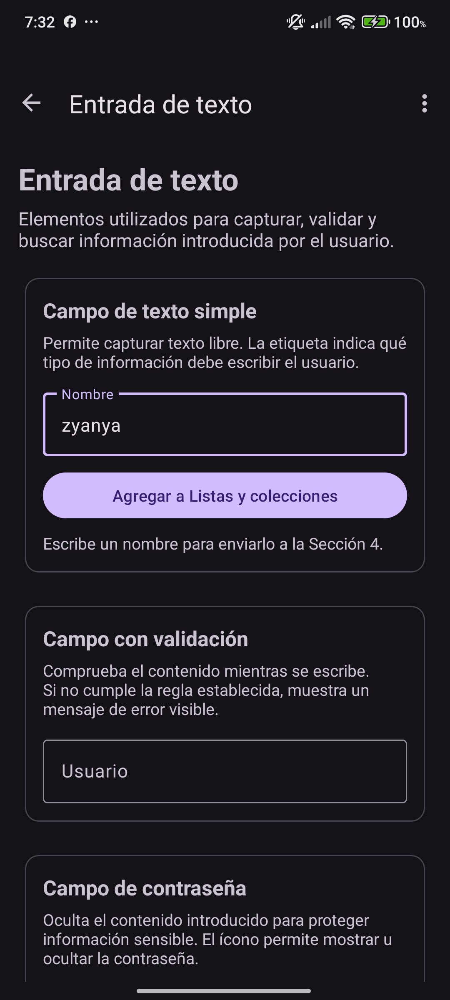</td>
<td align="center"><b>2. Botones y acciones</b><br>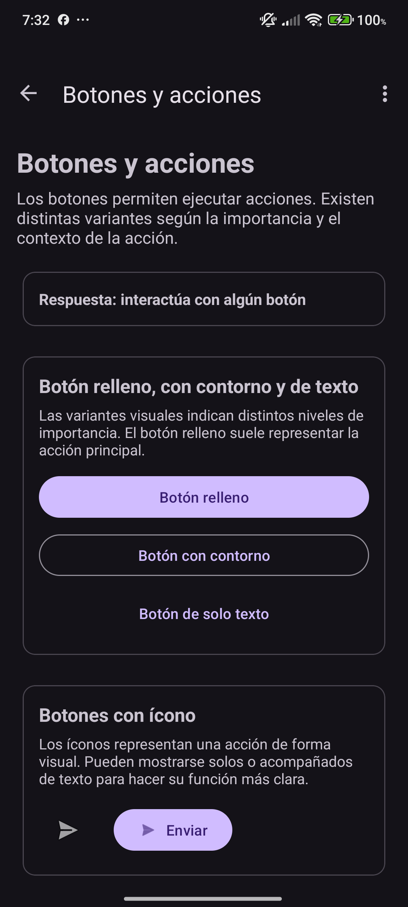</td>
</tr>
<tr>
<td align="center"><b>3. Elementos de selección</b><br>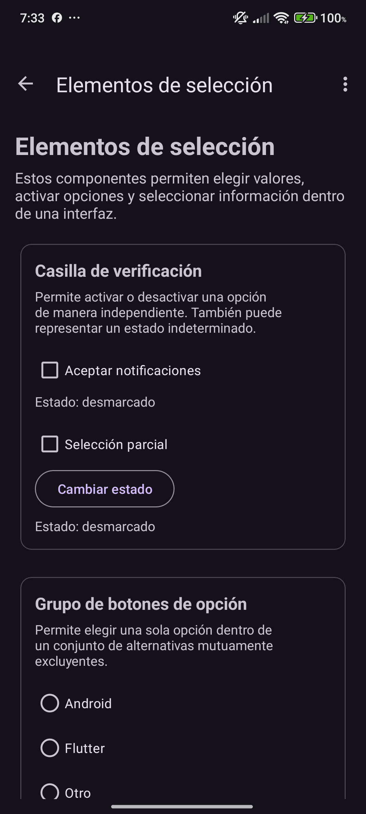</td>
<td align="center"><b>4. Listas y colecciones</b><br>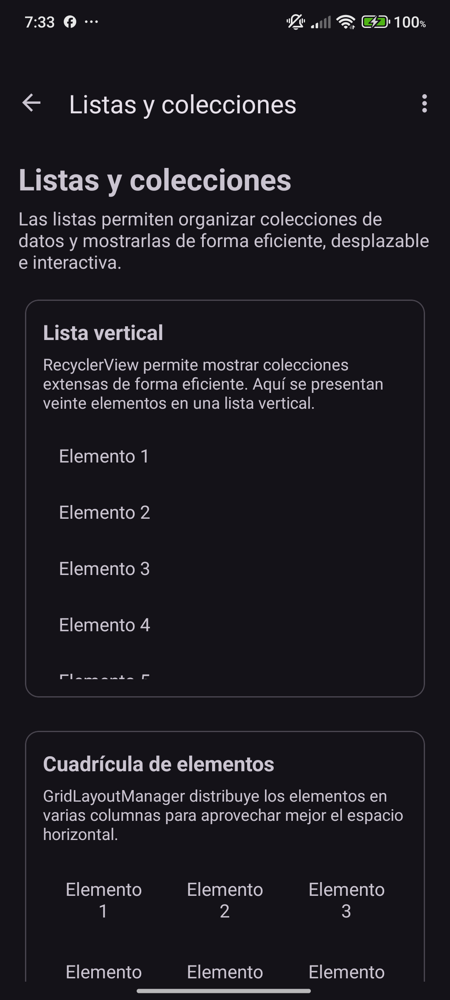</td>
<td align="center"><b>5. Información y retroalimentación</b><br>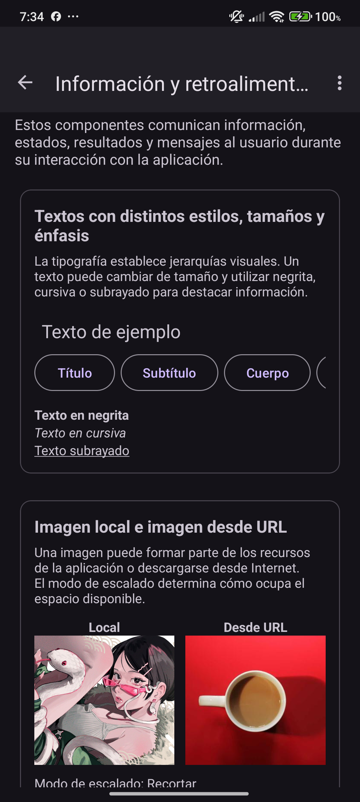</td>
</tr>
<tr>
<td align="center"><b>6. Contenedores y estructura</b><br>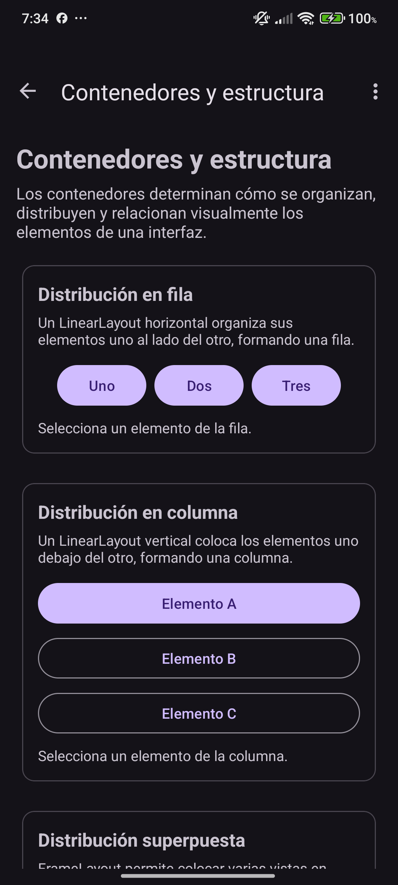</td>
<td></td>
<td></td>
</tr>
</table>

---

## Jetpack Compose

<table>
<tr>
<td align="center"><b>Menú principal</b><br>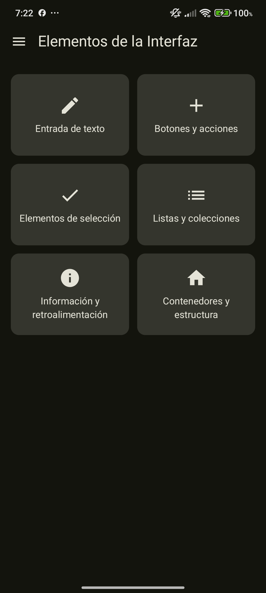</td>
<td align="center"><b>1. Entrada de texto</b><br>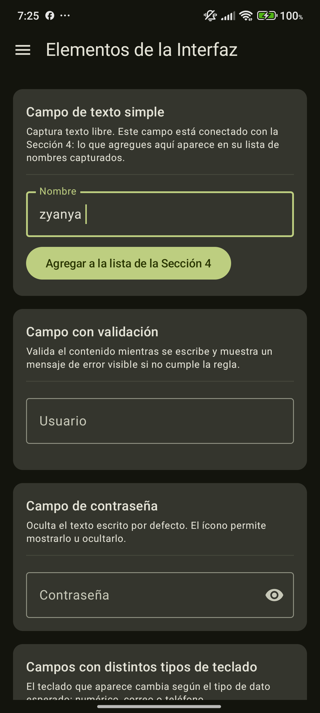</td>
<td align="center"><b>2. Botones y acciones</b><br>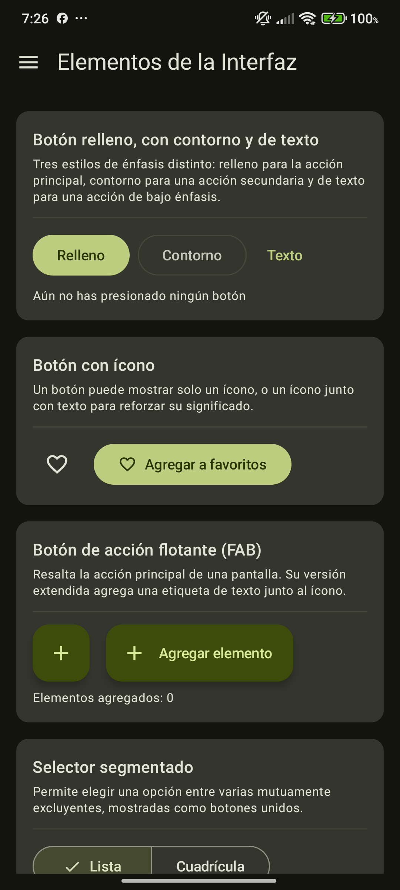</td>
</tr>
<tr>
<td align="center"><b>3. Elementos de selección</b><br>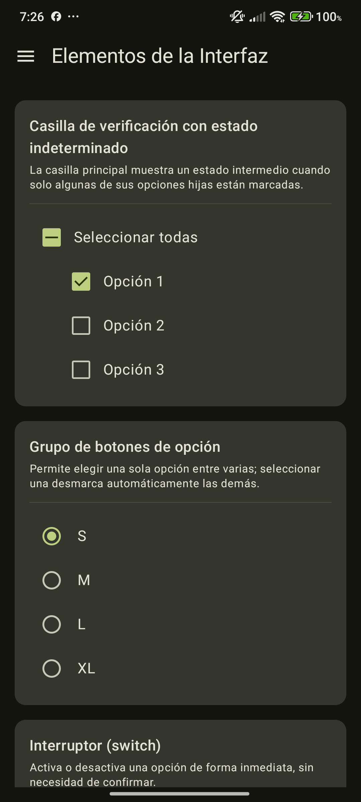</td>
<td align="center"><b>4. Listas y colecciones</b><br>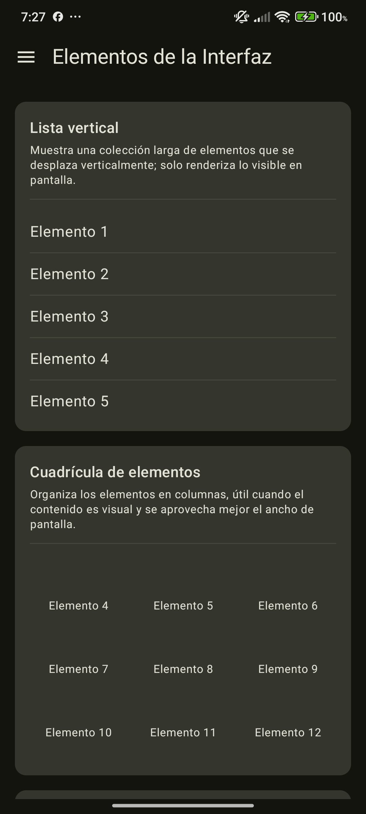</td>
<td align="center"><b>5. Información y retroalimentación</b><br>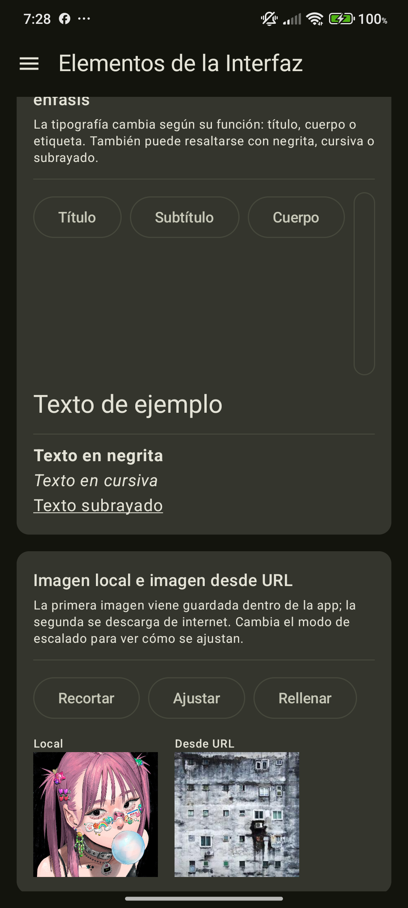</td>
</tr>
<tr>
<td align="center"><b>6. Contenedores y estructura</b><br>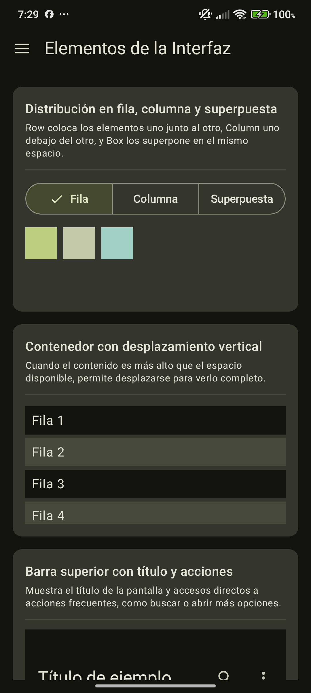</td>
<td></td>
<td></td>
</tr>
</table>

---

## Flutter

<table>
<tr>
<td align="center"><b>Menú principal</b><br>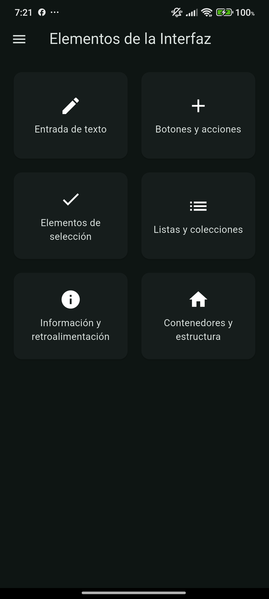</td>
<td align="center"><b>1. Entrada de texto</b><br>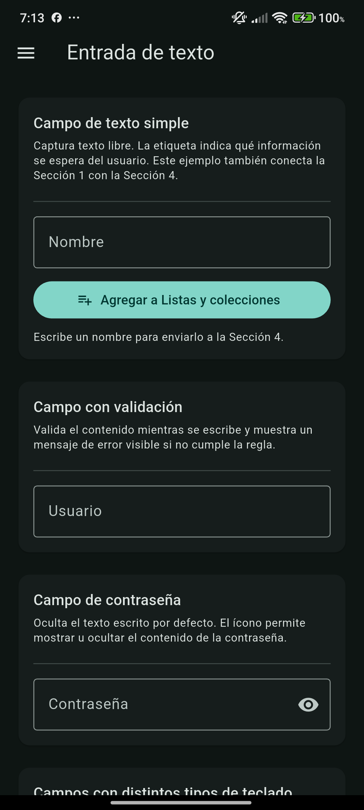</td>
<td align="center"><b>2. Botones y acciones</b><br>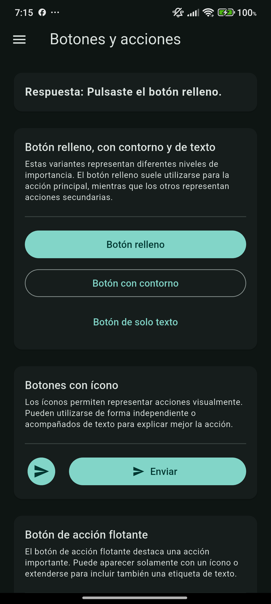</td>
</tr>
<tr>
<td align="center"><b>3. Elementos de selección</b><br>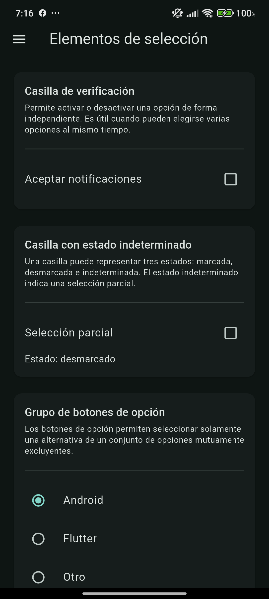</td>
<td align="center"><b>4. Listas y colecciones</b><br>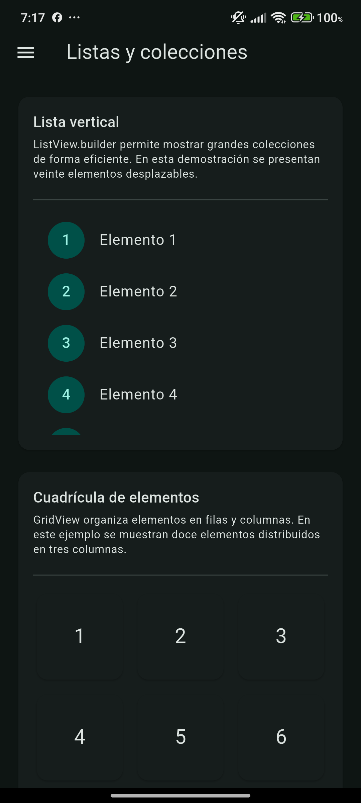</td>
<td align="center"><b>5. Información y retroalimentación</b><br></td>
</tr>
<tr>
<td align="center"><b>6. Contenedores y estructura</b><br>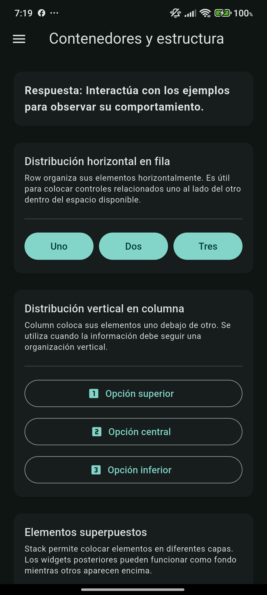</td>
<td></td>
<td></td>
</tr>
</table>

---

# Generación de APK

La entrega requiere un APK correspondiente a cada una de las tres versiones.

## Android Views

```powershell
cd android-views
.\gradlew.bat assembleDebug
```

Archivo generado:

```text
android-views/app/build/outputs/apk/debug/app-debug.apk
```

Nombre recomendado para la entrega:

```text
elementos-ui-android-views.apk
```

---

## Jetpack Compose

```powershell
cd android-compose
.\gradlew.bat assembleDebug
```

Archivo generado:

```text
android-compose/app/build/outputs/apk/debug/app-debug.apk
```

Nombre recomendado:

```text
elementos-ui-compose.apk
```

---

## Flutter

```powershell
cd flutter
flutter pub get
flutter build apk --debug
```

Archivo generado:

```text
flutter/build/app/outputs/flutter-apk/app-debug.apk
```

Nombre recomendado:

```text
elementos-ui-flutter.apk
```

## Organización recomendada de los binarios

Para la entrega final pueden copiarse a una carpeta:

```text
apks/
├── elementos-ui-android-views.apk
├── elementos-ui-compose.apk
└── elementos-ui-flutter.apk
```

Los archivos dentro de `build/` normalmente no se versionan en Git debido a `.gitignore`; por eso, si los APK deben formar parte del repositorio, deben copiarse manualmente fuera de `build/`.

---

# Comparación general de las tres tecnologías

| Aspecto | Android Views / XML | Jetpack Compose | Flutter |
|---|---|---|---|
| Paradigma | Imperativo / jerarquía de Views | Declarativo | Declarativo |
| Lenguaje | Kotlin + XML | Kotlin | Dart |
| Definición de UI | Archivos XML | Código Kotlin | Código Dart |
| Manejo de estado | Views + listeners | Estado Compose | `StatefulWidget` / `setState` |
| Listas | RecyclerView + Adapter | `LazyColumn` | `ListView` |
| Cuadrículas | RecyclerView + GridLayoutManager | `LazyVerticalGrid` | `GridView` |
| Navegación | Navigation Component | Navigation Compose | Drawer + estado |
| Tema | Themes XML DayNight | MaterialTheme | ThemeData |
| Velocidad de iteración | Media | Alta | Alta |
| Cantidad de código auxiliar | Alta | Baja / media | Baja / media |
| Separación UI / lógica | Muy marcada por XML + Kotlin | Dentro de composables y estado | Dentro del árbol de widgets y estado |
| Recarga rápida | recompilación Android | Apply Changes / previews | Hot Reload / Hot Restart |

---

# Reflexión final

El desarrollo de la misma aplicación en tres tecnologías permitió observar con claridad las diferencias entre un enfoque tradicional basado en vistas y dos enfoques declarativos modernos.

## ¿En cuál tecnología resultó más rápido construir la interfaz?

Durante esta práctica, **Flutter resultó especialmente rápido para construir y ajustar la interfaz**, principalmente por el uso de widgets consistentes y por Hot Reload. Una vez creada la estructura principal, fue posible agregar nuevas secciones reutilizando el mismo patrón de `StatefulWidget`, `Card`, `Column`, `ListView` y otros componentes sin tener que mantener archivos de interfaz separados.

Jetpack Compose también permitió avanzar con rapidez gracias a su modelo declarativo. La interfaz y la lógica de estado se encuentran muy próximas entre sí, lo que reduce parte del trabajo repetitivo que aparece en el sistema tradicional de Views.

Android Views / XML requirió más pasos para varias funcionalidades, debido a que fue necesario coordinar layouts XML, Fragments, View Binding, adaptadores, listeners y componentes adicionales.

## ¿Cuál generó código más legible?

Para esta aplicación, **Jetpack Compose produjo un código muy legible al representar la interfaz directamente como una composición de funciones**. Componentes como `Row`, `Column`, `LazyColumn`, `Button`, `Slider` y `Card` permiten entender la estructura visual observando únicamente el código Kotlin.

Flutter presentó una ventaja similar con su árbol de widgets. Sin embargo, cuando una pantalla contiene muchos componentes, la cantidad de anidamiento puede crecer y es importante dividir la interfaz en widgets pequeños.

Views/XML mantiene una separación clara entre estructura visual y lógica, lo cual puede ser útil en proyectos existentes, pero obliga a consultar tanto el archivo XML como el Fragment para comprender por completo el comportamiento de una pantalla.

## Dificultades encontradas

### Android Views / XML

Las principales dificultades fueron:

- mantener sincronizados XML y Kotlin;
- manejar identificadores de vistas;
- configurar correctamente RecyclerView y sus adaptadores;
- utilizar componentes como ViewPager2 y SwipeRefreshLayout;
- controlar estados de componentes Material;
- cargar imágenes remotas mediante una dependencia externa;
- implementar interacciones que en los enfoques declarativos requieren menos código.

### Jetpack Compose

Las principales dificultades fueron:

- administrar correctamente los estados;
- comprender la recomposición;
- elegir entre componentes Material equivalentes;
- manejar APIs que han cambiado entre versiones;
- integrar navegación, paginación y pull-to-refresh;
- mantener controlado el tamaño de funciones composables grandes.

### Flutter

Las dificultades principales fueron:

- configurar inicialmente el SDK de Flutter y el Android toolchain;
- aceptar/configurar correctamente las herramientas del SDK de Android;
- registrar assets en `pubspec.yaml`;
- manejar la navegación y el estado compartido entre pantallas;
- adaptar algunos conceptos nativos de Android a componentes equivalentes de Flutter;
- resolver elementos sin una equivalencia directa, como el toast nativo, mediante una solución propia con `OverlayEntry`.

## Tecnología con la que preferiría trabajar

Para un proyecto nuevo de características similares, **preferiría trabajar con Flutter**, ya que permitió construir rápidamente las interfaces, probar cambios mediante Hot Reload y utilizar componentes consistentes dentro de un único sistema de widgets.

No obstante, para una aplicación exclusivamente Android, Jetpack Compose también representa una opción muy conveniente porque ofrece las ventajas del desarrollo declarativo sin abandonar el ecosistema nativo de Kotlin y Android.

La comparación permitió concluir que no siempre existe una equivalencia uno a uno entre componentes. Lo importante es identificar el comportamiento requerido y utilizar en cada framework el elemento o combinación de elementos que mejor reproduzca esa función.

---

# Conclusiones

La práctica permitió implementar un catálogo amplio de controles de interfaz utilizando tres tecnologías distintas y comprobar que un mismo requisito funcional puede resolverse de formas diferentes.

Android Views mostró el funcionamiento tradicional de la plataforma y la separación entre XML y lógica. Jetpack Compose permitió representar el estado y la interfaz de manera declarativa utilizando Kotlin. Flutter ofreció una estructura basada en widgets con una experiencia de desarrollo rápida y consistente.

También se comprobó la importancia de aspectos que van más allá de colocar componentes en una pantalla:

- navegación;
- estado;
- validación;
- retroalimentación;
- listas dinámicas;
- actualización de contenido;
- adaptación al tema del sistema;
- reutilización;
- conexión de información entre distintas secciones.

El resultado final son tres aplicaciones equivalentes a nivel funcional, cada una implementada con los mecanismos propios de su tecnología.

---

# Referencias

Android Developers. (s. f.). *View*. Android Developers. https://developer.android.com/reference/android/view/View

Android Developers. (s. f.). *Compose layout basics*. Android Developers. https://developer.android.com/develop/ui/compose/layouts/basics

Android Developers. (s. f.). *Layouts and content*. Android Developers. https://developer.android.com/design/ui/mobile/guides/layout-and-content/layout-basics

Android Developers. (s. f.). *Jetpack Compose*. Android Developers. https://developer.android.com/compose

Android Developers. (s. f.). *Navigation*. Android Developers. https://developer.android.com/guide/navigation

Coil Contributors. (s. f.). *Coil: Image loading for Android backed by Kotlin Coroutines*. Coil. https://coil-kt.github.io/coil/

Flutter. (s. f.). *Layouts in Flutter*. Flutter documentation. https://docs.flutter.dev/ui/layout

Flutter. (s. f.). *Layout widgets*. Flutter documentation. https://docs.flutter.dev/ui/widgets/layout

Flutter. (s. f.). *Material component widgets*. Flutter documentation. https://docs.flutter.dev/ui/widgets/material

Flutter. (s. f.). *Display a snackbar*. Flutter documentation. https://docs.flutter.dev/cookbook/design/snackbars

Flutter. (s. f.). *Material library*. Flutter API documentation. https://api.flutter.dev/flutter/material/

Kotlin. (s. f.). *Kotlin documentation*. https://kotlinlang.org/docs/home.html

Dart. (s. f.). *Dart documentation*. https://dart.dev/guides
